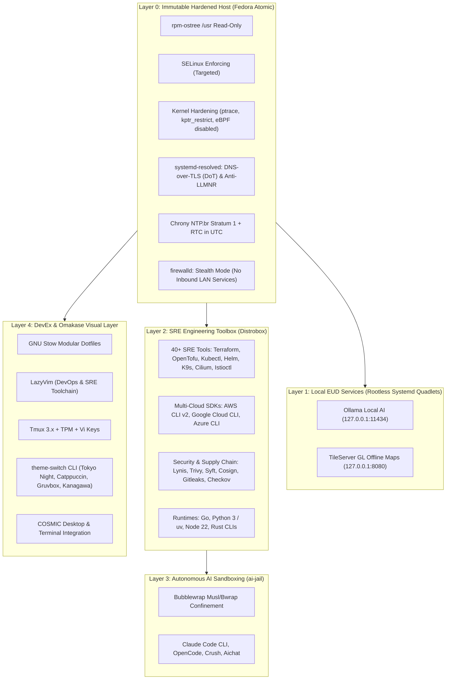

# 🚀 Ariel's Personal IDP: SRE Workstation & Platform Engineering

[](https://github.com/ariel99gf/dotfiles/actions/workflows/ci.yml)
[](https://ansible.readthedocs.io/projects/lint/)
[](ansible/local/verify.yml)
[](https://github.com/gitleaks/gitleaks)
[](https://fedoraproject.org/)
[](https://podman.io/)
[](https://opensource.org/licenses/MIT)

> A production-grade **Personal Internal Developer Platform (IDP)** and declarative workstation built upon **Site Reliability Engineering (SRE)**, **DevSecOps**, and **Stateless Immutable Infrastructure** principles on **Fedora Atomic (rpm-ostree / COSMIC Desktop)**.

---

## 🎯 Executive Summary & Philosophy

In modern software engineering, we never accept production servers configured manually without automated testing, idempotency guarantees, and version control. Yet, many engineers still tolerate configuration drift (*OS rot*), fragile bash scripts, and unversioned tools on their primary development machines.

This repository treats the personal workstation with the exact same rigor as a mission-critical cloud platform:
- **Zero OS Drift:** Base operating system (`/usr`) is an immutable image. Host packages remain pristine and minimal.
- **Containerized Engineering Cockpit:** 40+ DevOps, Cloud, and SRE CLI tools run inside an isolated **Distrobox** container (`sre-toolbox`).
- **Autonomous AI Sandboxing:** LLM CLI agents (Claude Code, OpenCode, Crush) are executed under **`ai-jail`** (Bubblewrap sandboxing) to prevent unintended filesystem modification or credential leaks.
- **Defense in Depth & Zero Trust:** Local microservices (Ollama AI, TileServer GL) run as rootless Systemd Quadlets bound strictly to `127.0.0.1`. Stealth firewall, kernel hardening, DNS-over-TLS, and Stratum 1 Chrony NTP.br synchronization.
- **Disaster Recovery (RTO < 15 min):** A single idempotent command restores a freshly formatted machine to full productivity (`bootstrap.sh`).
- **Test-Driven Infrastructure:** **57 automated acceptance assertions** validate hardware, network, security, and dotfile symlinks on every update.

---

## 🏗 Multi-Layer Architecture



---

## 🛡️ SRE & Platform Engineering Pillars

### 1. Infrastructure as Code (IaC) & Idempotency
All system states, kernel parameters, container units, and dotfiles are declared in structured Ansible playbooks and Jinja2 templates. Re-running the orchestrator produces zero drift (`changed: 0`).

### 2. Shift-Left Testing & Verification Pyramid
```text
           ▲
          / \     Host Acceptance Suite (57 Live Assertions)
         /   \    verify.yml & timedatectl / chronyc / resolvectl
        /-----\
       /       \   Integration & Idempotency Testing
      /         \  Molecule (Podman/Docker Container Lifecycle)
     /-----------\
    /             \ Static Analysis & DevSecOps Quality Gate
   /               \ ansible-lint (Production Profile) + Gitleaks + bash -n
```
- **Static Analysis:** `ansible-lint` passing with **0 failures and 0 warnings** under profile `production`.
- **Secrets Audit:** **144+ commits** scanned with `gitleaks` (zero leaks). Active pre-commit hooks block raw private keys, unformatted YAML, and loose credentials.
- **Acceptance Gate:** `mise run verify` validates 57 granular system assertions across hardware, network, security, and developer ergonomics.

### 3. Zero Trust & In-Memory Credential Injection
- No plaintext SSH private keys or API tokens exist in Git or unencrypted on the filesystem.
- Chaves SSH e SOPS Age são restauradas diretamente do cofre Bitwarden para a memória RAM (`unlock-ssh` e `restore-sops`).
- Histórico do Shell mascarado (`HISTIGNORE`) para impedir vazamento acidental de tokens e chaves no `.bash_history`.

### 4. Disaster Recovery & Minimum RTO
If the physical machine is lost or replaced:
1. Boot fresh Fedora Silverblue / Kinoite / Atomic.
2. Clone repository and run `./bootstrap.sh`.
3. In ~10-15 minutes, the workstation is restored with all drivers, kernel hardening, container engines, and developer tooling fully verified.

---

## 📂 Repository Structure

```text
.
├── .github/
│   └── workflows/ci.yml         # GitHub Actions CI (Gitleaks, Bash -n, Ansible-Lint, Molecule)
├── .ansible-lint                # Production profile configuration for Ansible
├── .mise.toml                   # Unified platform task runner and orchestration
├── .pre-commit-config.yaml      # Quality gate (trailing-whitespace, check-yaml, Gitleaks)
├── bootstrap.sh                 # Zero-to-Hero disaster recovery provisioning engine
├── install.sh                   # Minimal standalone dotfile bootstrapper
│
├── ansible/
│   ├── requirements.yml         # Ansible collection dependencies (community.general)
│   ├── local/
│   │   ├── hosts.ini            # Localhost inventory definition
│   │   ├── setup_pc.yml         # Main orchestrator (Host Hardening, EUD Quadlets, Stow)
│   │   └── verify.yml           # Acceptance test suite (57 automated assertions)
│   └── roles/
│       └── system_tuning/       # Modular SRE role (sysctl, DoT resolved, limits, Chrony)
│           └── molecule/default # Containerized idempotency and lifecycle scenario
│
├── bash/                        # Shell aliases, history hardening & Bitwarden functions (GNU Stow)
├── cosmic/                      # COSMIC Desktop & Terminal typography/theming (GNU Stow)
├── devcontainer/                # Standardized DevContainer templates for DevPod
├── distrobox/                   # SRE Toolbox container specification (distrobox.ini & provision-sre.sh)
├── nvim/                        # LazyVim IDE configured for DevOps & Cloud-Native (GNU Stow)
├── scripts/                     # theme-switch CLI & SOPS recovery tools (GNU Stow)
├── ssh/                         # Hardened SSH client configuration & Bitwarden agent (GNU Stow)
├── starship/                    # Fast, informative SRE-tuned cross-shell prompt (GNU Stow)
└── tmux/                        # Modernized tmux with Vi-keys, TPM, and Catppuccin theme (GNU Stow)
```

---

## ⚡ Daily Workflow & DevEx (Orchestration via Mise)

All operational tasks are standardized through **Mise**, offering an intuitive CLI interface without remembering complex Ansible or Podman syntax:

### Quality Assurance & Testing
```bash
# Run complete test suite (lint + syntax check + 57 host assertions):
mise run test

# Run static analysis (Ansible-Lint inside SRE container):
mise run lint

# Validate syntax of all playbooks:
mise run test:syntax

# Run deep host acceptance verification (57 assertions):
mise run verify
```

### System & Workstation Management
```bash
# Apply host security tuning, DoT, Chrony, and firewalld (requires sudo):
mise run apply:system

# Apply user dotfiles, stow symlinks, DevPod, and user services:
mise run apply

# Switch workstation visual theme (Tokyo Night, Catppuccin, Gruvbox, Kanagawa):
mise run theme
# or directly:
theme-switch tokyo-night
```

### SRE Container Cockpit
```bash
# Enter the SRE Toolbox with 40+ engineering tools:
sre
# (or 'distrobox enter sre-toolbox')

# Run an AI agent inside a secure sandbox:
jclaude          # Claude Code CLI
jopencode        # OpenCode
jcrush           # Crush (Charmbracelet)
```

---

## 🚀 Bootstrap from Bare Metal (Zero-to-Hero)

On a freshly installed Fedora Atomic machine:

```bash
# 1. Clone repository
git clone https://github.com/ariel99gf/dotfiles.git ~/Projects/dotfiles
cd ~/Projects/dotfiles

# 2. Run automated disaster recovery bootstrap
./bootstrap.sh
```

The script will automatically:
1. Verify OS compatibility (Fedora Atomic / rpm-ostree).
2. Install minimal bootstrap dependencies (Ansible, GNU Stow, Git).
3. Apply GNU Stow dotfile symlinks to `$HOME`.
4. Assemble and provision the `sre-toolbox` Distrobox container.
5. Execute system hardening playbooks (Kernel tuning, DoT, Chrony NTP.br, Stealth Firewall).
6. Deploy rootless Systemd Quadlets for Ollama and TileServer GL (bound to `127.0.0.1`).
7. Run the **57-assertion acceptance suite** to guarantee a 100% compliant environment.

---

## 📜 License

Distributed under the **MIT License**. See `LICENSE` for more information.
